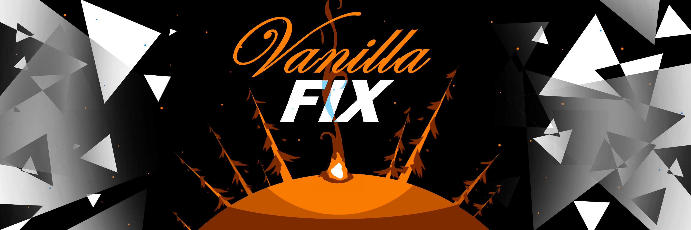

# VanillaFix
Fixes some vanilla bugs in Outer Wilds

## Fixes
- Makes the proxy sun's atmosphere look correct. (credit to MegaPiggy)
- Properly resets PlayerState on scene change.
- Adds some missing button prompt textures. (credit to MegaPiggy)
- Prevents SetLanguage from being called when it shouldn't be, fixing several mods.